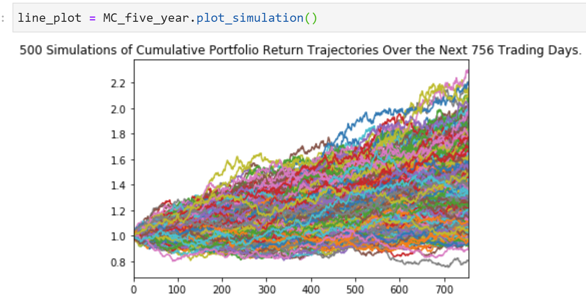
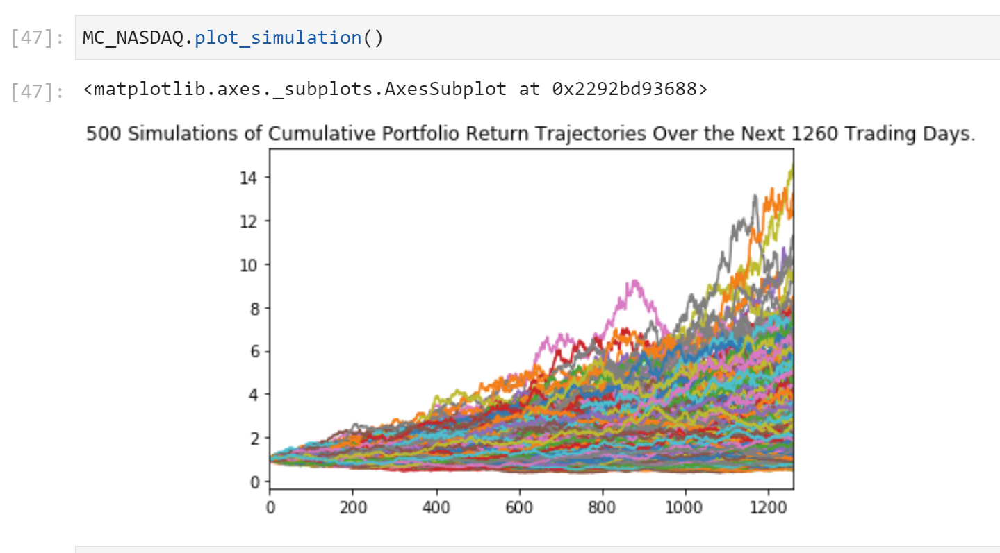
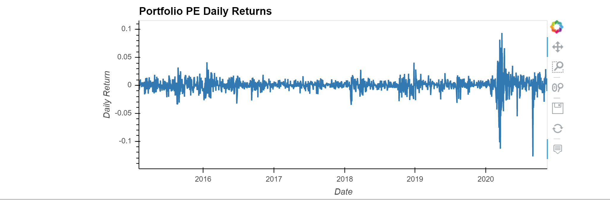
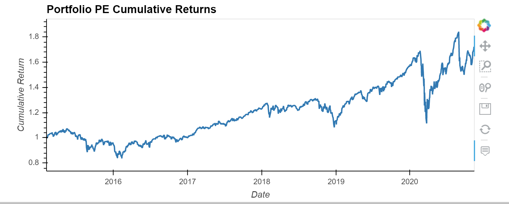
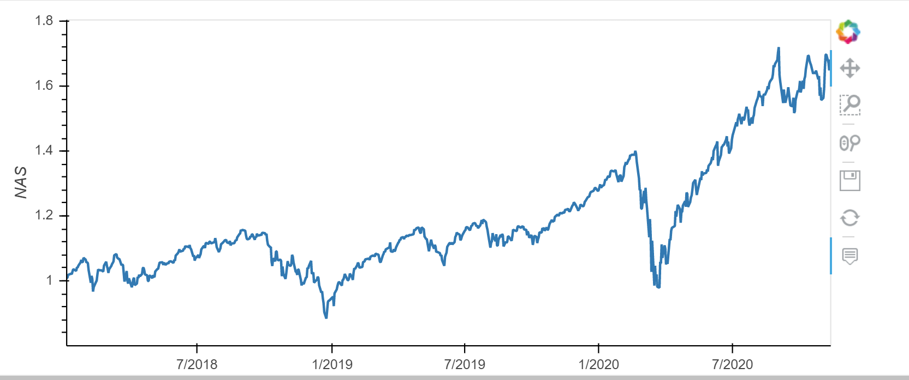
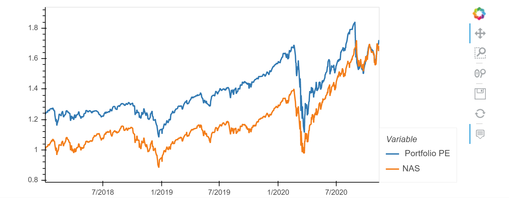

# Stash-Portfolio
 
 
 ## Background 

The goal of this project is to analyze my personal portfolio and compare it agianst NASDAQ to visually see how it would perform over the next the next 5yrs. If the performance shows positive growth I can confidently advice a new investor that this would be a solid group of ETF's to invest in.

## Files
* NASDAQ.csv
* AOA.csv
* ICLN.csv
* AAPPL.csv
* PHO.csv
* SCHD.csv 
* VWO.csv
* SPLV.csv 

## Plan

To provide a profitable portfolio I need to accomplish three main tasks:

1. Data-Modeling: Clean the data, merge columns of the personal portfolio  and also make sure time stamps match up on my data frames.

2. Performance-Analysis: Run both data frames with Monte Carlo Simulation to forcast a 5 year projection of a possible investment of $10,000.

3. Visualization: Calculate the cumulative returns and visualize the data for both data frames then compare the cumulative returns of both data frames and determine the perfomrance overtime. 

## Simulations 

## Daily Returns Personal Portfolio PE

## Cumulative Personal Portfolio PE & NASDAQ Cumulative

## All Cumulative Compared

